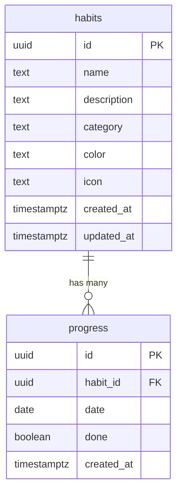

## Overview

Habits Tracker uses Supabase (PostgreSQL) for data persistence. The schema consists of two main tables with a one-to-many relationship.

## Tables

### habits

Stores information about each habit.

| Column | Type | Constraints | Description |
|--------|------|-------------|-------------|
| `id` | uuid | PRIMARY KEY, DEFAULT gen_random_uuid() | Unique identifier |
| `name` | text | NOT NULL, CHECK (3-50 chars) | Habit name |
| `description` | text | CHECK (max 200 chars) | Optional description |
| `category` | text | CHECK (enum values) | Category classification |
| `color` | text | NOT NULL, DEFAULT '#3b82f6' | Hex color code |
| `icon` | text | - | Emoji or icon identifier |
| `created_at` | timestamptz | DEFAULT now() | Creation timestamp |
| `updated_at` | timestamptz | DEFAULT now() | Last update timestamp |

#### Category values

The `category` column accepts these values:
- `Wellness`
- `Learning`
- `Fitness`
- `Health`
- `Productivity`
- `Other`

#### Example record

```json
{
  "id": "550e8400-e29b-41d4-a716-446655440000",
  "name": "Morning meditation",
  "description": "10 minutes of mindfulness practice",
  "category": "Wellness",
  "color": "#93c5fd",
  "icon": "🧘",
  "created_at": "2024-01-15T08:00:00Z",
  "updated_at": "2024-01-15T08:00:00Z"
}
```

### progress

Tracks daily completion status for each habit.

| Column | Type | Constraints | Description |
|--------|------|-------------|-------------|
| `id` | uuid | PRIMARY KEY, DEFAULT gen_random_uuid() | Unique identifier |
| `habit_id` | uuid | NOT NULL, FOREIGN KEY -> habits(id) | Reference to habit |
| `date` | date | NOT NULL | Date of progress (YYYY-MM-DD) |
| `done` | boolean | NOT NULL, DEFAULT false | Completion status |
| `created_at` | timestamptz | DEFAULT now() | Creation timestamp |

#### Constraints

- **UNIQUE(habit_id, date)** - Prevents duplicate entries for the same habit on the same day
- **ON DELETE CASCADE** - Automatically deletes progress when habit is deleted

#### Example record

```json
{
  "id": "660e8400-e29b-41d4-a716-446655440001",
  "habit_id": "550e8400-e29b-41d4-a716-446655440000",
  "date": "2024-01-15",
  "done": true,
  "created_at": "2024-01-15T20:30:00Z"
}
```

## Indexes

Performance optimization through strategic indexing:

```sql
CREATE INDEX idx_progress_habit_id ON progress(habit_id);
CREATE INDEX idx_progress_date ON progress(date);
```

### Index purposes

- **idx_progress_habit_id** - Speeds up queries filtering by habit
- **idx_progress_date** - Optimizes date-range queries for analytics

## Relationships



## Row Level Security (RLS)

### Current configuration

The application uses public access policies for simplicity:

```sql
-- Habits table policies
CREATE POLICY "Allow public read access to habits"
  ON habits FOR SELECT TO public USING (true);

CREATE POLICY "Allow public insert to habits"
  ON habits FOR INSERT TO public WITH CHECK (true);

CREATE POLICY "Allow public update to habits"
  ON habits FOR UPDATE TO public USING (true) WITH CHECK (true);

CREATE POLICY "Allow public delete to habits"
  ON habits FOR DELETE TO public USING (true);

-- Progress table policies (similar structure)
```

<Warning>
The current RLS configuration allows unrestricted public access. This is suitable for demo purposes but should be modified for production use with user authentication.
</Warning>

### Production recommendations

For production deployment with user authentication:

```sql
-- Enable user-specific access
CREATE POLICY "Users can view own habits"
  ON habits FOR SELECT
  USING (auth.uid() = user_id);

CREATE POLICY "Users can insert own habits"
  ON habits FOR INSERT
  WITH CHECK (auth.uid() = user_id);

CREATE POLICY "Users can update own habits"
  ON habits FOR UPDATE
  USING (auth.uid() = user_id);

CREATE POLICY "Users can delete own habits"
  ON habits FOR DELETE
  USING (auth.uid() = user_id);
```

<Note>
This requires adding a `user_id` column to the habits table and implementing Supabase authentication.
</Note>

## Migration

The database schema is defined in a migration file:

```
supabase/migrations/20251112153501_create_habits_tracker_schema.sql
```

### Applying migrations

If using Supabase CLI:

```bash
supabase db push
```

If using Supabase dashboard:
1. Navigate to SQL Editor
2. Copy migration file contents
3. Execute the SQL

## Common queries

### Get all habits with progress count

```sql
SELECT 
  h.*,
  COUNT(p.id) FILTER (WHERE p.done = true) as completed_days
FROM habits h
LEFT JOIN progress p ON h.id = p.habit_id
GROUP BY h.id
ORDER BY h.created_at DESC;
```

### Get weekly progress for a habit

```sql
SELECT date, done
FROM progress
WHERE habit_id = $1
  AND date >= CURRENT_DATE - INTERVAL '7 days'
  AND date <= CURRENT_DATE
ORDER BY date;
```

### Calculate longest streak

```sql
WITH daily_progress AS (
  SELECT 
    habit_id,
    date,
    done,
    date - ROW_NUMBER() OVER (
      PARTITION BY habit_id, done 
      ORDER BY date
    )::integer AS streak_group
  FROM progress
  WHERE done = true
)
SELECT 
  habit_id,
  COUNT(*) as streak_length,
  MIN(date) as streak_start,
  MAX(date) as streak_end
FROM daily_progress
GROUP BY habit_id, streak_group
ORDER BY streak_length DESC
LIMIT 1;
```

## Data validation

### Application-level validation

The application enforces validation before database operations:

```javascript
// Habit name validation
if (name.length < 3 || name.length > 50) {
  throw new Error('Name must be between 3 and 50 characters');
}

// Description validation
if (description && description.length > 200) {
  throw new Error('Description must be 200 characters or less');
}

// Category validation
const validCategories = [
  'Wellness', 'Learning', 'Fitness', 
  'Health', 'Productivity', 'Other'
];
if (!validCategories.includes(category)) {
  throw new Error('Invalid category');
}
```

### Database-level validation

PostgreSQL CHECK constraints provide additional validation:

```sql
-- Name length constraint
CHECK (char_length(name) >= 3 AND char_length(name) <= 50)

-- Description length constraint
CHECK (description IS NULL OR char_length(description) <= 200)

-- Category enum constraint
CHECK (category IN ('Wellness', 'Learning', 'Fitness', 
                    'Health', 'Productivity', 'Other'))
```

## Backup and recovery

### Automated backups

Supabase provides automatic daily backups for all projects.

### Manual export

Export data using the export service:

```javascript
import { exportService } from './services/export.js';

// Export all data to JSON
exportService.exportToJSON(habits, progress);
```

### Data restoration

To restore from a JSON export:

1. Parse the JSON file
2. Use the Supabase client to insert records
3. Handle conflicts with upsert operations

## Performance considerations

### Query optimization

- Use indexes for frequently filtered columns
- Limit result sets with pagination
- Use `select()` to fetch only needed columns
- Leverage Supabase's connection pooling

### Scaling recommendations

For high-traffic applications:
- Enable Supabase's read replicas
- Implement caching layer (Redis)
- Use database connection pooling
- Consider partitioning for large datasets

## Next steps

<CardGroup cols={2}>
  <Card title="API reference" icon="code" href="/habits-tracker/api-reference">
    Learn about services and components
  </Card>
  <Card title="Architecture" icon="sitemap" href="/habits-tracker/architecture">
    Understand the technical design
  </Card>
  <Card title="Features" icon="sparkles" href="/habits-tracker/features">
    Explore all capabilities
  </Card>
  <Card title="Deployment" icon="rocket" href="/habits-tracker/deployment">
    Deploy to production
  </Card>
</CardGroup>
